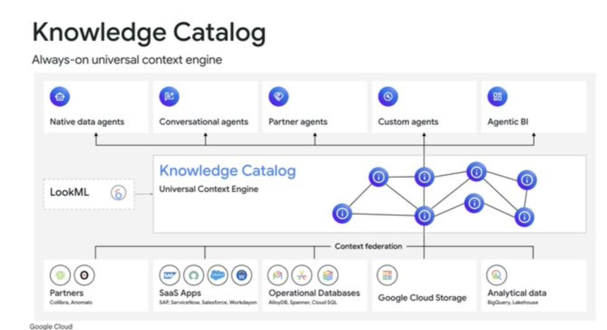

# Knowledge Catalog & Agentic Architecture

This architecture represents the shift from simple retrieval (RAG) to autonomous **Agentic AI** systems that leverage a unified context layer.

## 1. The Universal Context Engine (Knowledge Catalog)
*   **Role:** Acts as the semantic "brain" of the organization.
*   **Relationship Mapping:** Maps connections between disparate data points (nodes) to provide deeper context than simple keyword searching.
*   **Context Federation:** Enables searching across multiple silos (SaaS, Databases, Cloud Storage) without data duplication.

## 2. Agentic Output Layer
*   **Native Data Agents:** Direct interfaces for structured data/SQL queries.
*   **Conversational Agents:** LLM-driven interfaces for human-like interaction.
*   **Agentic BI:** Autonomous analytics that explain "why" metrics change, not just "what" they are.
*   **Partner/Custom Agents:** Specialized agents for specific vendor platforms or custom business logic.

## 3. Data Integration & Semantics
*   **LookML:** Provides a semantic layer to translate technical database columns into business concepts the AI can understand.
*   **Multimodality:** Integration of various data types including SaaS apps, operational databases (AlloyDB), and analytical warehouses (BigQuery).

*Source: Google Cloud Architecture for Agentic AI (2026)*
